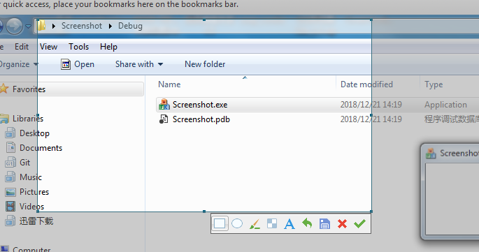

##### 说明

硬盘上的一份截图代码，作者是sudami。

提取了里面的3个类CatchScreenDlg、MyTracker.h，MyEdit，自己在实现下。

双缓冲，完美无闪烁。

##### 截图




##### 说明

1、重写了MyEdit的绘制，避免闪烁。

2、修改CCatchScreenDlg中部分逻辑，避免闪烁

3、增加ToolBar控件，仿QQ截图界面。按钮实际功能未开发。

4、实现截图飞选中区域暗色处理


##### ToolBar控件消息处理

```c++
BOOL CCatchScreenDlg::OnCommand(WPARAM wParam, LPARAM lParam)
{
	bool bHandle = true;
	HWND hWnd = m_toolBar.GetHWND();
	if(lParam == (LPARAM)m_toolBar.GetHWND())
	{
		int wmId  = LOWORD(wParam);
		switch(wmId)
		{
		case MyToolBar_ID:
			AfxMessageBox(_T("矩形"));
			break;
		case MyToolBar_ID+1:
			AfxMessageBox(_T("圆形"));
			break;
		case MyToolBar_ID +2:
			AfxMessageBox(_T("画笔"));
			break;
		case MyToolBar_ID +3:
			AfxMessageBox(_T("马赛克"));
			break;
		case MyToolBar_ID +4:
			AfxMessageBox(_T("文字"));
			break;
		case MyToolBar_ID +5:
			AfxMessageBox(_T("撤销"));
			break;
		case MyToolBar_ID +6:
			CopyScreenToBitmap(m_rectTracker.m_rect, TRUE);
			PostQuitMessage(0);
			break;
		case MyToolBar_ID +7:
			PostQuitMessage(0);
			break;
		case MyToolBar_ID +8:
			CopyScreenToBitmap(m_rectTracker.m_rect, TRUE);
			PostQuitMessage(0);
			break;
		default:
			bHandle = false;
			break;
		}
		::SetFocus(hWnd);
	}
	if (bHandle == false)
	{
		return CDialog::OnCommand(wParam,lParam);
	}
}
```


##### 神奇的非选中区域暗色处理算法

```c++
		Gdiplus::Graphics graphics(dcCompatible);

		HRGN hgn1 = CreateRectRgn(m_rectTracker.m_rect.left,m_rectTracker.m_rect.top,
			m_rectTracker.m_rect.right,m_rectTracker.m_rect.bottom);
		Region region1(hgn1);

		HRGN hgn2 = CreateRectRgn(rect.left,rect.top,
			rect.right,rect.bottom);
		Region region2(hgn2);

		region2.Exclude(&region1);

		SolidBrush  solidBrush(Color(100, 128, 128, 128));
		graphics.FillRegion(&solidBrush,&region2);

		DeleteObject(hgn1);
		DeleteObject(hgn2);
```


